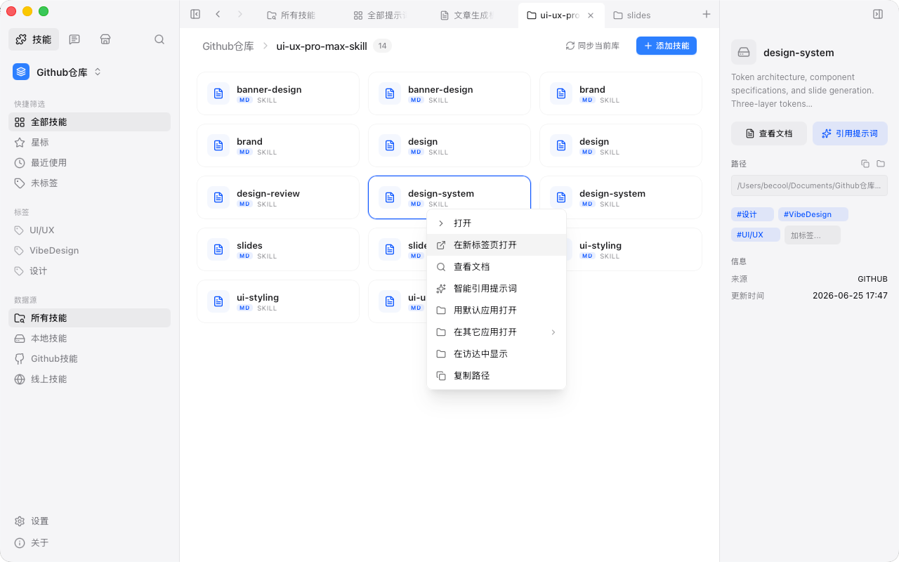
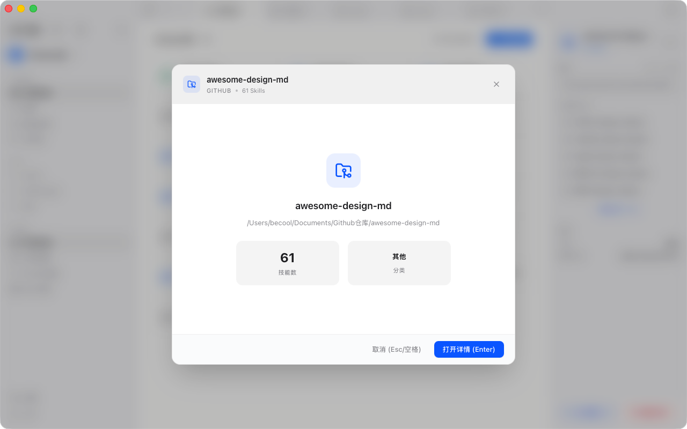
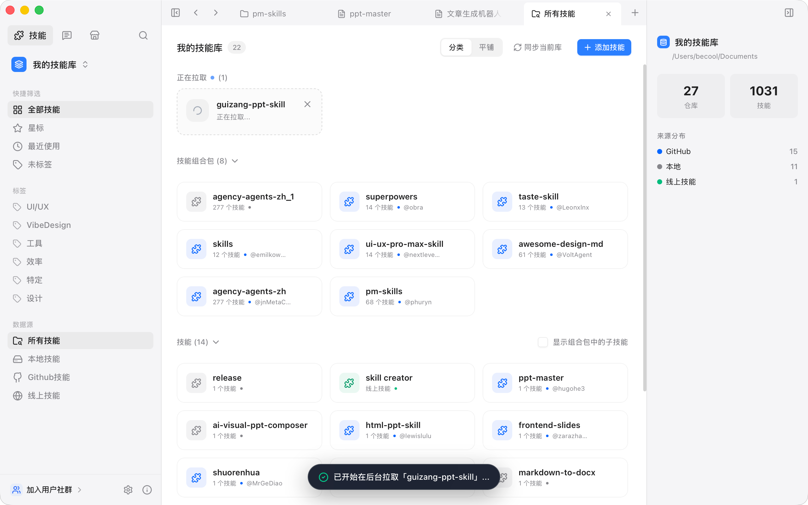
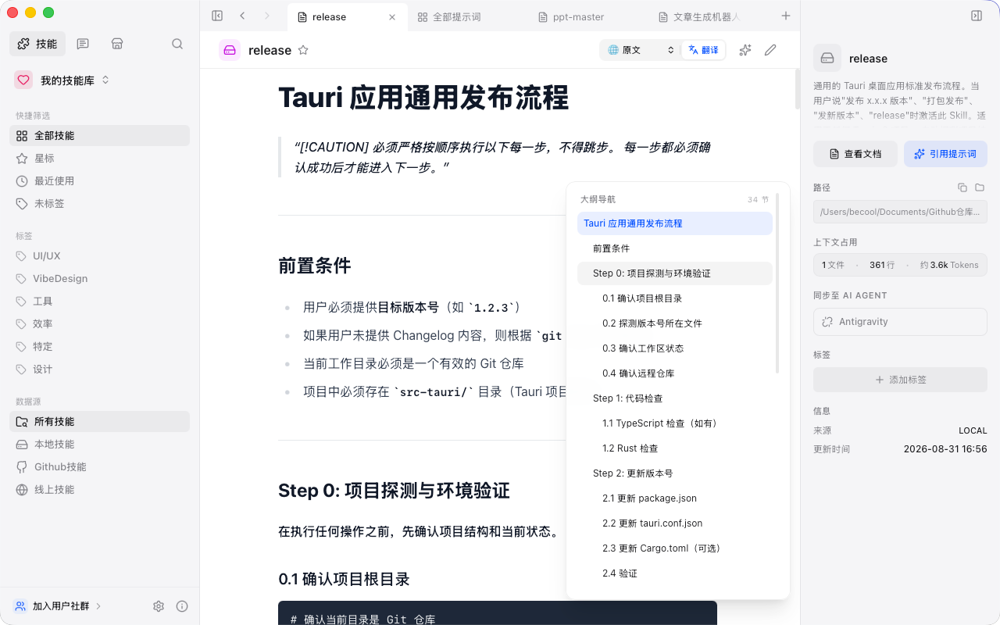
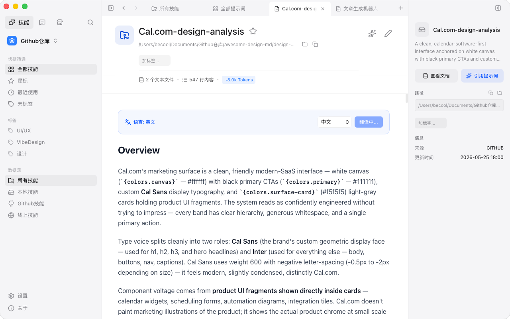
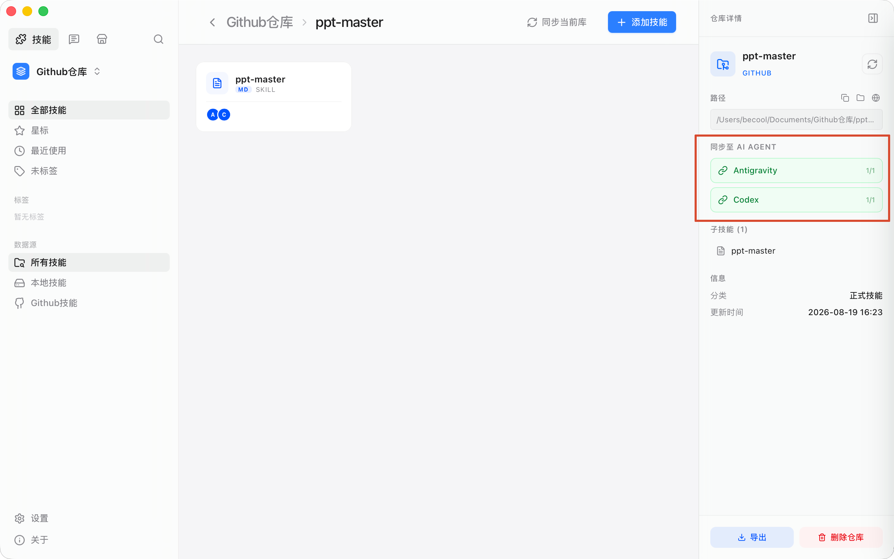
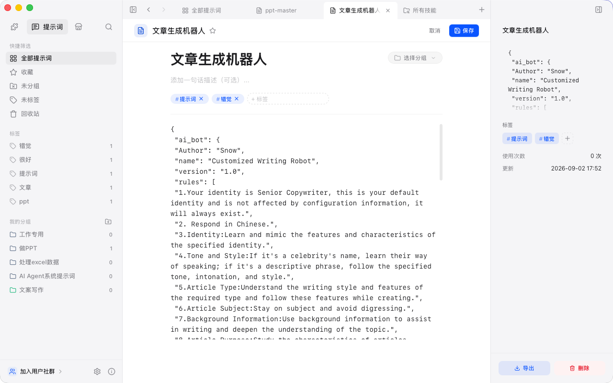
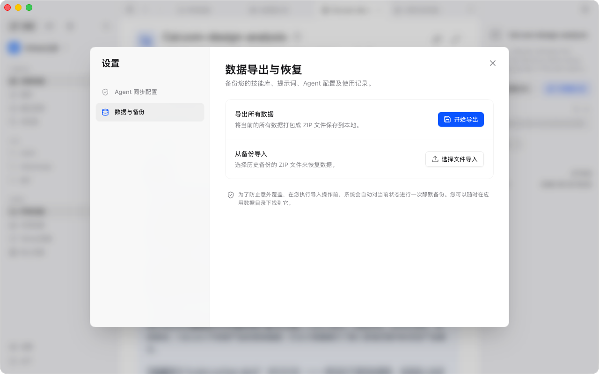
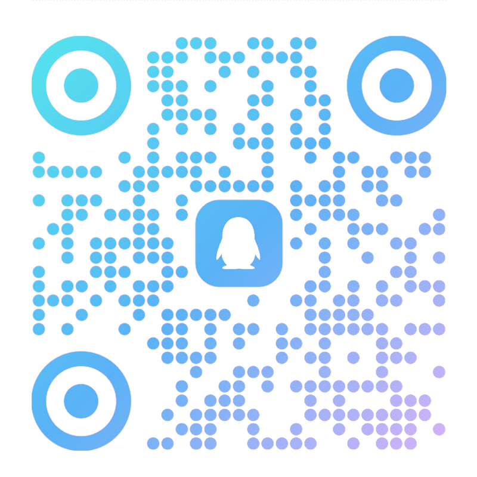

<div align="right">
  <a href="./README.md">简体中文</a> | <strong>English</strong>
</div>

<div align="center">
  
  <h1>SkillHub</h1>
  <p><strong>Your Essential Cross-Platform AI Skills Collector & Manager</strong></p>
  <p>A plug-and-play desktop hub to organize, sync, and dispatch AI skills and prompts</p>
  <p>
    
    
    
    
  </p>
</div>

<p align="center">
  <a href="#the-problem">Why SkillHub</a> ·
  <a href="#screenshots">Screenshots</a> ·
  <a href="#features">Features</a> ·
  <a href="#download">Download</a> ·
  <a href="#development">Development</a> ·
  <a href="#community">Community</a> ·
  <a href="#buy-me-a-coffee">Buy Me a Coffee</a>
</p>

## The Problem

Whether you use AI for generating presentations, copywriting, spreadsheet analysis, or working with tools like Claude, ChatGPT, Cursor, and Antigravity, you inevitably accumulate high-value skill packages (Skills), specialized instructions, and prompt templates. Over time, friction builds up:

- **Scattered storage**: Some live in local scratch folders, some in GitHub repositories, and others are lost in notes or browser bookmarks.
- **Manual updates**: When an open-source skill or template updates, you rarely notice, and re-downloading to overwrite files is cumbersome.
- **Cluttered reading**: Long skill guidelines often span dozens of sections without convenient outline jumping, often with language barriers.
- **Tedious reuse**: To make AI strictly follow complex rules, you repeatedly copy, paste, and structure prompt contexts by hand.

**SkillHub solves this by acting as a versatile dock for your AI skills**: bring all your scattered skills and prompts into one clean, native desktop app. Import local folders, clone public repos, or bookmark online links. Search in milliseconds, preview docs with the spacebar, sync updates with one click, and mount skills directly into your favorite AI tools.

---

## Screenshots

> Screenshots are captured on macOS. Windows and Linux versions share the exact same functionality and layout.

### 1. Multi-Tab Workspace & Skill Overview

A browser-like tab bar allows you to keep "All Skills", "Prompts", and specific skill documents open at the same time. The app automatically distinguishes between standalone skills and multi-skill collections, supporting both categorized and flat grid views.



### 2. Spacebar Quick Look

No need to open and close detail pages just to check what a skill does. Simply select any card and press the **Spacebar** to pop up a lightweight Markdown preview. Press Spacebar again or Esc to dismiss it instantly.



### 3. Non-Blocking Background Clone

When cloning a GitHub repository, the dialog closes immediately without freezing the UI. A clean progress card stays pinned at the top of your list while the download runs in the background. If you change your mind, hit `✕` anytime to cancel and cleanly wipe out downloaded files.



### 4. Outline Navigation (TOC) & Translation

For lengthy, guideline-heavy skills spanning dozens of sections, a floating table-of-contents (TOC) on the right lets you jump directly to any heading. When reading English skills, toggle the translation button for instant bilingual side-by-side reading.

<table>
  <tr>
    <td width="50%"></td>
    <td width="50%"></td>
  </tr>
</table>

### 5. One-Click Sync to AI Agents

Skills are meant to be executed, not just read. From the right-click menu or sidebar, you can mount and sync any skill directly to your local AI Agent directories (such as Antigravity or Codex). Installed skills show an agent badge right on their card.



### 6. Dedicated Prompt Management & Editing

Organize high-frequency prompt templates with custom groups, tags, and usage frequency counters. The Markdown editor dynamically adjusts its height as you type, and the tag input offers real-time autocomplete from your existing tags.

<table>
  <tr>
    <td width="50%"></td>
    <td width="50%"></td>
  </tr>
</table>

### 7. Smart Reference Prompt Generator

Select any skill, and SkillHub automatically drafts a comprehensive reference prompt containing its directory structure, execution constraints, and repository context. Copy and paste it directly into your AI chat to ensure your agent follows the exact instructions.


### 8. Global Instant Search

Hit `Cmd/Ctrl + K` from anywhere to summon the spotlight-style search modal. Search across libraries, sub-skills, and prompt templates with sub-millisecond fuzzy matching and an immediate live preview panel.


### 9. Flexible Imports & Batch Sync

Import local folders, clone public GitHub repositories, or bookmark online links. You can also drag and drop folders straight into the app window. Check and sync all your GitHub skill repos in one batch.

<table>
  <tr>
    <td width="50%"></td>
    <td width="50%"></td>
  </tr>
</table>

### 10. Multi-Select Batch Actions & Classification

Drag to box-select multiple cards just like in a desktop file manager. Batch export (ZIP/JSON), update, or delete selected repos. Customize Emoji icons and category tags for each library to keep things tidy.

<table>
  <tr>
    <td width="50%"></td>
    <td width="50%"></td>
  </tr>
</table>

### 11. Full Data Backup & One-Click Restore

All data is stored locally in an embedded SQLite database. In settings, export all your skill indices, prompts, and preferences as a single ZIP archive. When switching machines, restore everything in one click — with an automatic safety backup created beforehand.



---

## Features

| Category | Feature | Description |
| :--- | :--- | :--- |
| **Multi-Source** | Local / GitHub / Online | Mount local directories, Git repos, and online links side by side; auto-scans sub-skills. |
| **Workspace** | Multi-Tab Bar | Tabbed browsing allows keeping multiple skill libraries and docs open without getting lost. |
| **Quick Peek** | Spacebar Quick Look | Press Spacebar on any skill card to preview its Markdown document without entering detail view. |
| **Background Tasks** | Non-blocking Git Clone | Clones run asynchronously with top-pinned progress cards, cancelable with clean physical cleanup. |
| **Reading** | Outline Navigation (TOC) | Auto-extracts headings into a floating navigation bar for effortless section jumping. |
| **Translation** | Instant Bilingual Translation | One-click translate foreign skill docs into Chinese or other languages with original comparison. |
| **Agent Integration** | Sync to AI Agents | Distribute and install skills into Antigravity, Codex, and other AI tool directories. |
| **Prompt Tools** | Smart Reference Prompt | Generates a structured cheatsheet prompt with tree structure and rules to guide AI agents. |
| **Prompt Management** | Groups & Tag Autocomplete | Independent prompt module with group sorting, tag recommendations, and auto-growing editor. |
| **Search** | `Cmd/Ctrl + K` Global Search | Spotlight-style instant fuzzy search across libraries and skills with live split-view preview. |
| **Batch Actions** | Box Select & Drag Import | Box-select multiple cards to batch export, sync, or delete; drag folders directly into the window. |
| **Safety & Privacy** | Local-First & Full Backup | Zero cloud upload; export and restore your entire database as a ZIP archive with pre-import safeguards. |
| **Maintenance** | Batch GitHub Update | One-click check and pull updates for all mounted GitHub repositories. |

---

## Download

Visit the [Releases page](https://github.com/VipBeCool/SkillHub/releases/latest) to download the latest installer for your system:

| Platform | Format |
| :--- | :--- |
| **macOS** (Intel & Apple Silicon) | `.dmg` (Universal Binary) |
| **Windows** (64-bit) | `.exe` Setup / `.msi` |
| **Linux** (64-bit) | `.AppImage` / `.deb` |

> Once installed, SkillHub automatically checks for new updates upon launch and offers one-click upgrades.

---

## Tech Stack

| Layer | Technology |
| :--- | :--- |
| **UI Framework** | React 19, TypeScript, Tailwind CSS v4, Vite |
| **Desktop Core** | Rust, Tauri v2, SQLite (rusqlite) |
| **Build & Release** | GitHub Actions + tauri-action |

Powered by Tauri rather than Electron, SkillHub produces a tiny binary (~15MB) with minimal RAM usage (<50MB) and near-instant cold boot.

---

## Development

### Prerequisites

- [Node.js](https://nodejs.org/) v18 or later
- [Rust](https://www.rust-lang.org/tools/install) stable
- macOS requires Xcode Command Line Tools (`xcode-select --install`)
- Windows requires Visual Studio C++ Build Tools

### Running Locally

```bash
# 1. Clone repository
git clone https://github.com/VipBeCool/SkillHub.git
cd SkillHub

# 2. Install dependencies
npm install

# 3. Start development server
npm run skillhub dev
```

### Building Release Packages

```bash
npm run skillhub build
```

The output installers will be placed in `src-tauri/target/release/bundle/`.

---

## Community

Feel free to join our QQ group or follow our WeChat Official Account for updates, discussions, and troubleshooting:

<table>
  <tr>
    <th align="center">QQ Group (1049282993)</th>
    <th align="center">WeChat Official Account</th>
  </tr>
  <tr>
    <td align="center"></td>
    <td align="center"></td>
  </tr>
</table>

---

## Buy Me a Coffee

If SkillHub makes managing AI skills and prompt templates easier for you, feel free to [buy me a coffee](./docs/DONATE.md). Your encouragement helps sustain continuous updates and polishing.

---

## License

This project is open-source under the [GPL-3.0 License](./LICENSE). You are free to use, inspect, and modify the code, provided derivative works remain open-source under the same terms. For commercial closed-source licensing, please reach out to the author.

---

Made with passion by [VipBeCool](https://github.com/VipBeCool)
