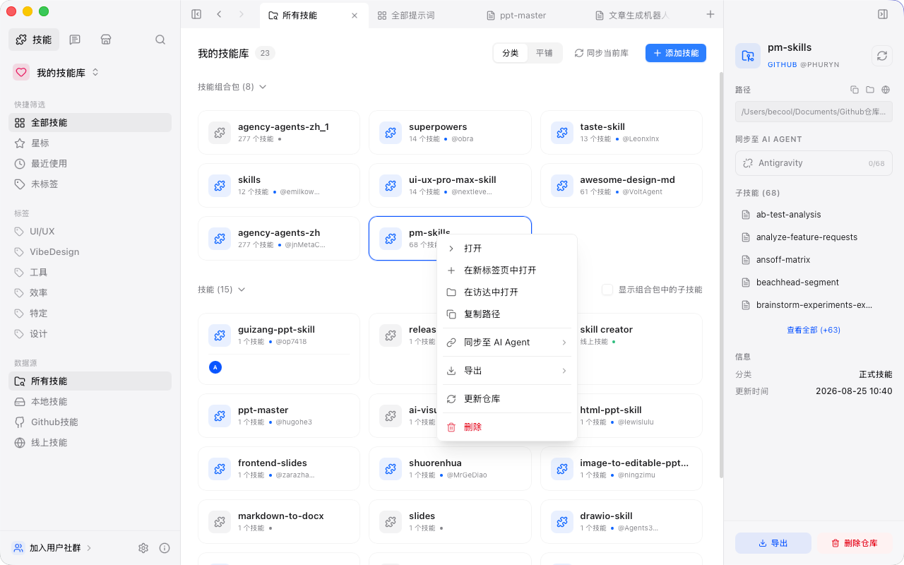
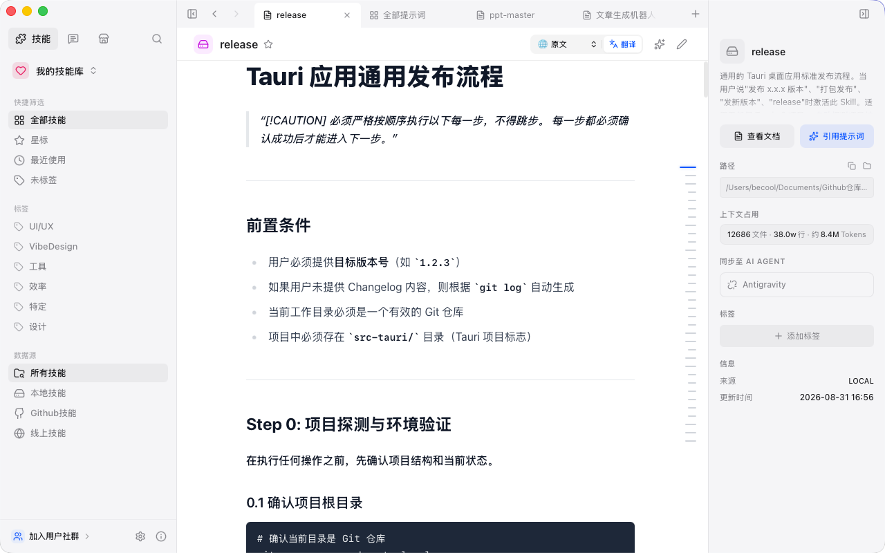
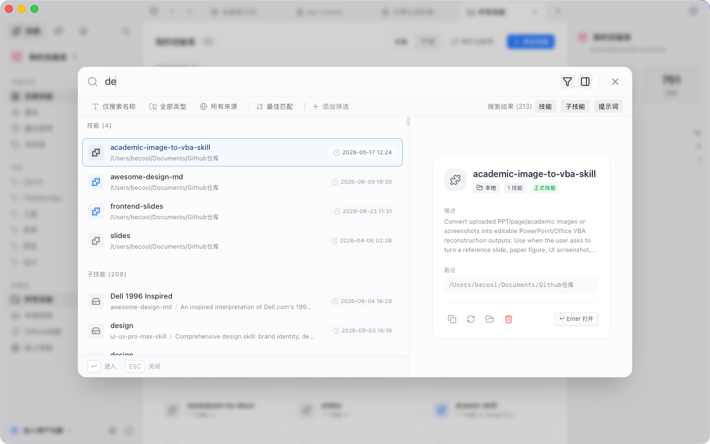
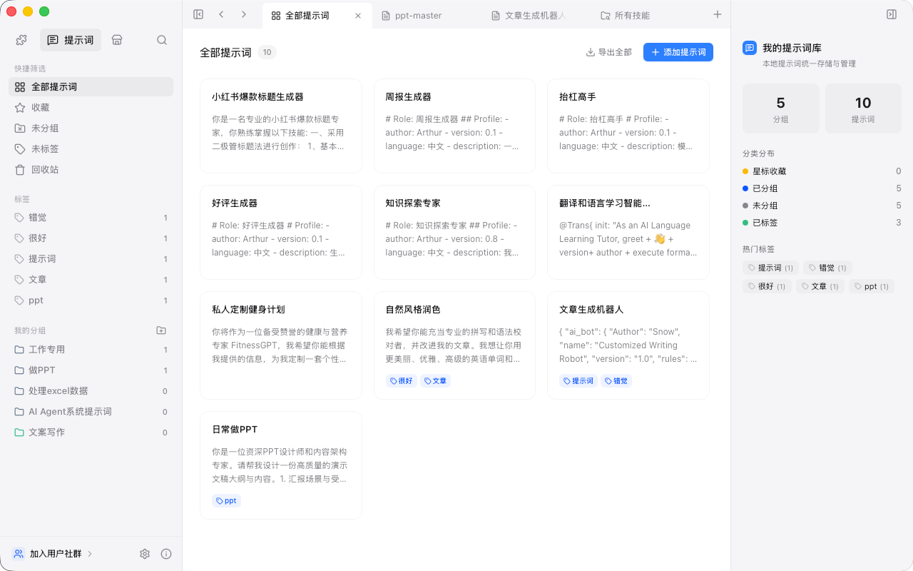
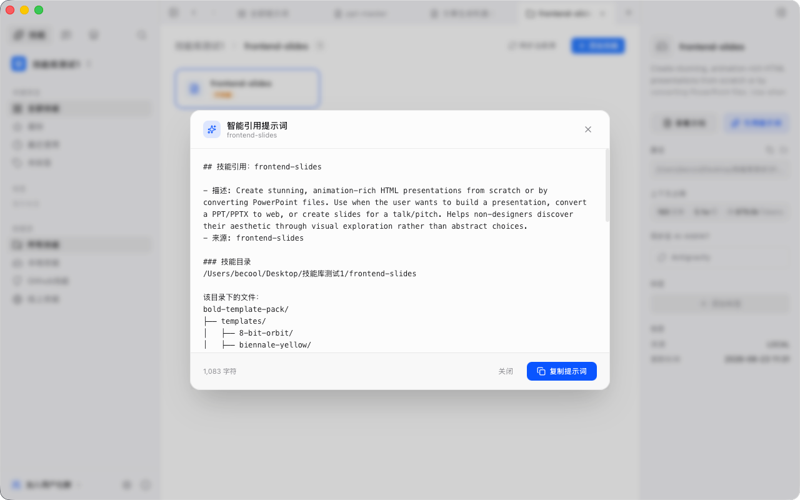
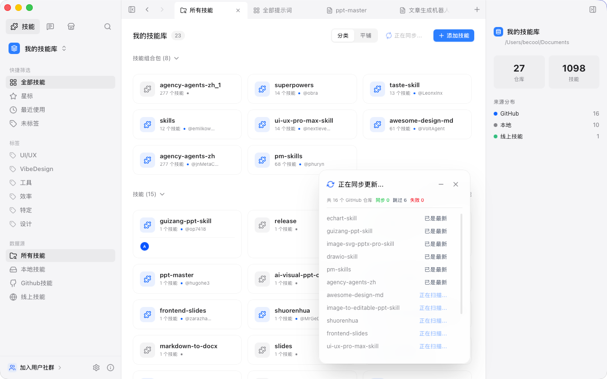
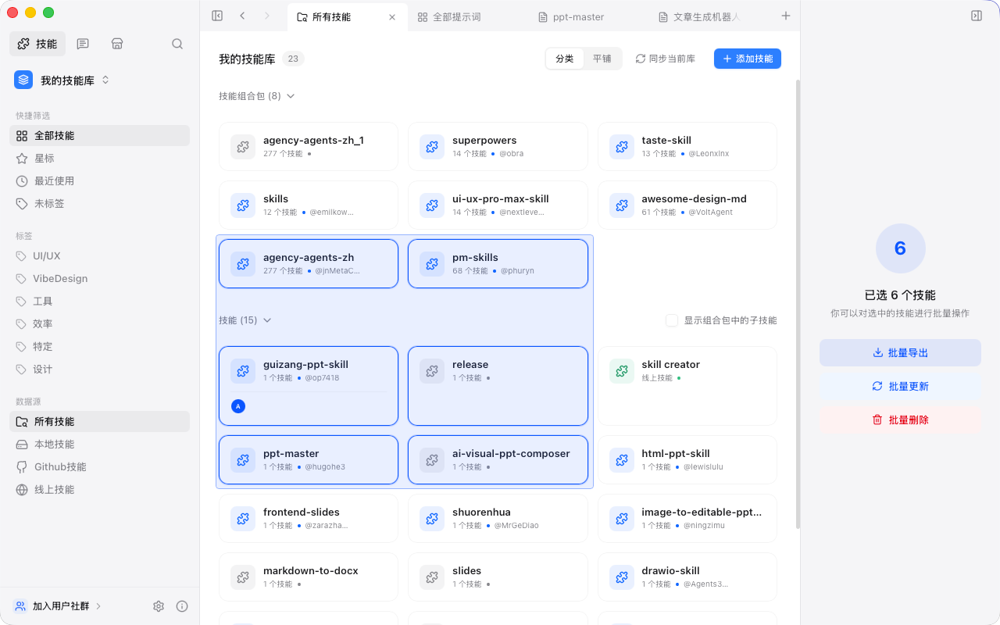
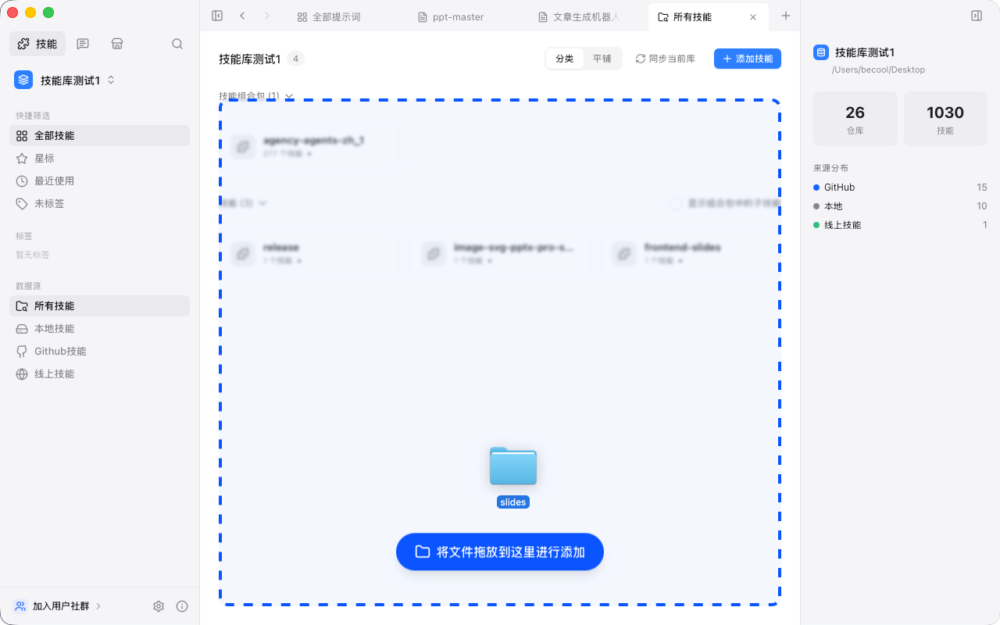
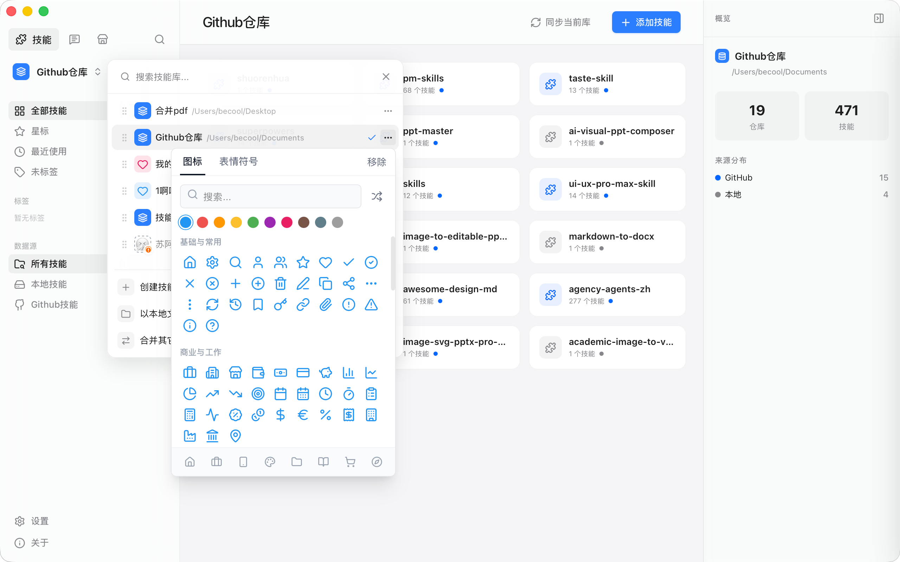

<div align="right">
  <strong>简体中文</strong> | <a href="./README.en.md">English</a>
</div>

<div align="center">
  
  <h1>SkillHub</h1>
  <p>把散落各处的 AI 技能和 Prompt 收到一个地方管理</p>
  <p>
    
    
    
    
  </p>
</div>

<p align="center">
  <a href="#它解决什么问题">为什么需要</a> ·
  <a href="#看看长什么样">截图</a> ·
  <a href="#功能">功能</a> ·
  <a href="#下载安装">下载</a> ·
  <a href="#本地开发">开发</a>
</p>

## 它解决什么问题

用 Claude Code、Cursor、Codex 这些 AI 编码工具时，技能文件（Skills / Rules）和 Prompt 模板越攒越多——有的在本地文件夹里，有的在 GitHub 仓库，有的是网上看到顺手收藏的链接。想找一个之前用过的技能要翻好几个地方，GitHub 上的技能库更新了也不知道。

SkillHub 把这些东西收到同一个界面里：导入本地文件夹、克隆 GitHub 仓库、收藏线上链接，统一检索和管理。技能有更新时一键同步，不用手动 `git pull`。Prompt 模板也有独立的管理模块，带分组、标签和版本记录。

## 看看长什么样

> 截图来自 macOS，Windows 和 Linux 界面基本一致。

### 技能库总览

挂载多个技能来源（本地 / GitHub / 线上），右键可以在访达中打开、同步到 AI Agent、导出或更新。



### 技能详情

查看技能内容、文件数、行数和 Token 数。内置翻译，英文技能可以直接看中文。



### 全局搜索

`Cmd/Ctrl + K` 打开搜索，同时检索技能库和子技能，右侧即时预览。



### Prompt 管理

独立的 Prompt 模块，支持分组、标签、使用次数统计和多语言切换。



### 智能引用提示词

选中技能后自动生成引用提示词——包含目录结构、执行指令和仓库上下文，复制到 AI 对话中就能让 Agent 按这个技能工作。



### 导入 & 同步

三种导入方式：本地文件夹、GitHub 克隆、线上链接收藏。也可以直接把文件夹拖进窗口。导入后，工具会在后台自动无感解析各种类型的技能格式，不用操心文件结构。GitHub 仓库支持一键批量同步。

<table>
  <tr>
    <td></td>
    <td></td>
  </tr>
</table>

### 批量操作 & 拖拽导入

框选多个技能库，批量导出、更新或删除。文件夹拖进窗口即可添加。

<table>
  <tr>
    <td></td>
    <td></td>
  </tr>
</table>

### 分类与细节体验

支持灵活的标签分类系统，还可以自定义 Emoji 图标来区分不同的技能库，让管理更加清晰顺手。



## 功能

| 功能 | 说明 |
|------|------|
| 多源挂载 | 同时挂载本地文件夹、GitHub 仓库和线上链接，自动扫描并无感解析各种技能格式 |
| 分类与展示 | 支持灵活的标签分类，支持自定义技能库 Emoji 图标 |
| Prompt 管理 | 独立模块，支持分组、标签、使用次数统计、版本历史、Markdown 预览 |
| 全局搜索 | `Cmd/Ctrl + K`，同时搜技能库和子技能，右侧即时预览 |
| GitHub 同步 | 一键拉取所有 GitHub 仓库变更，逐个显示同步状态 |
| 智能引用 | 自动生成包含目录结构和执行指令的引用提示词 |
| 同步至 Agent | 技能可直接同步到 Antigravity、Codex 等 AI Agent |
| 批量操作 | 框选多个技能库，批量导出（ZIP/JSON）、更新、删除 |
| 拖拽导入 | 文件夹拖进窗口直接添加 |
| 内置翻译 | 英文技能一键翻译为中文（或其他语言） |
| 应用内更新 | 启动时自动检查新版本，一键安装 |

## 下载安装

前往 [Releases](https://github.com/VipBeCool/SkillHub/releases/latest) 下载：

| 平台 | 安装包 |
|------|--------|
| macOS (Intel + Apple Silicon) | `.dmg` |
| Windows (x64) | `.exe` / `.msi` |
| Linux (x64) | `.AppImage` / `.deb` |

装过的用户会在应用内收到更新提示，不用手动下载。

## 技术栈

| 层级 | 技术 |
|------|------|
| 前端 | React 19, TypeScript, Tailwind CSS v4, Vite |
| 后端 | Rust, Tauri v2, SQLite (rusqlite) |
| CI/CD | GitHub Actions + tauri-action |

用 Tauri 而不是 Electron，安装包小，内存占用低。

## 本地开发

### 环境要求

- [Node.js](https://nodejs.org/) v18+
- [Rust](https://www.rust-lang.org/tools/install) 稳定版
- macOS 需要 Xcode Command Line Tools
- Windows 需要 Visual Studio C++ Build Tools

### 运行

```bash
git clone https://github.com/VipBeCool/SkillHub.git
cd SkillHub
npm install
npm run skillhub dev
```

### 构建

```bash
npm run skillhub build
```

安装包输出到 `src-tauri/target/release/bundle/`。

### 版本号管理

版本号分布在 `package.json`、`src-tauri/tauri.conf.json`、`src-tauri/Cargo.toml` 三处，用脚本一次改完：

```bash
node scripts/bump-version.mjs 0.2.0
```

## 开源协议

[GPL-3.0](./LICENSE)。可以自由使用和修改，但衍生项目也要开源。商业闭源使用请联系作者。

---

Made by [VipBeCool](https://github.com/VipBeCool)
