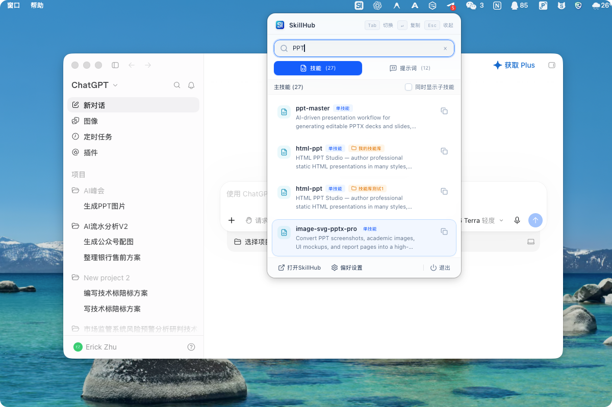
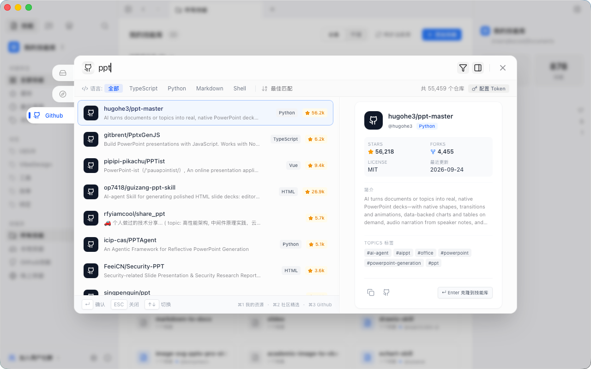
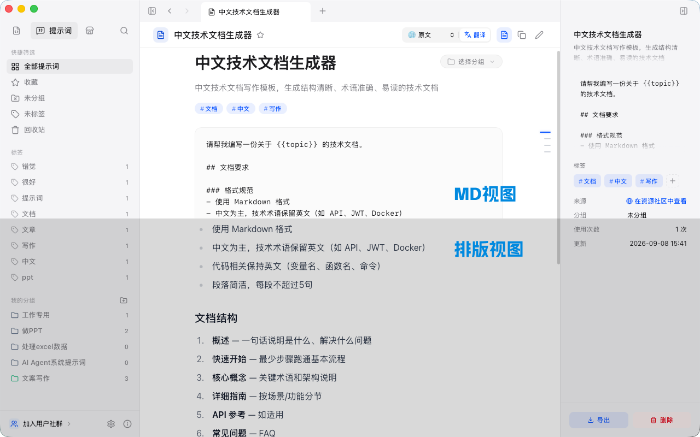

<div align="right">
  <strong>简体中文</strong> | <a href="./README.en.md">English</a>
</div>

<div align="center">
  
  <h1>SkillHub</h1>
  <p><strong>你的跨平台必备 AI Skills 搜集与管理工具</strong></p>
  <p>即插即用，一站式整理、同步与调用海量 AI 技能与 Prompt</p>
  <p>
    
    
    
    
  </p>
</div>

<p align="center">
  <a href="#它解决什么问题">为什么需要</a> ·
  <a href="#看看长什么样">功能截图</a> ·
  <a href="#核心特性清单">特性清单</a> ·
  <a href="#下载安装">下载安装</a> ·
  <a href="#本地开发">本地开发</a> ·
  <a href="#交流群">交流群</a> ·
  <a href="#请我喝咖啡">支持项目</a>
</p>

## 它解决什么问题

平时不管是做 PPT、写文案、分析表格数据，还是使用 Claude、ChatGPT、Cursor、Antigravity 等各类 AI 工具与智能体，大家往往会积攒大量好用的专业技能包（Skills）、工作流规则和高频 Prompt 模板。时间一长，容易遇到这些繁琐问题：

- **存放散乱**：有的存放在本地临时文件夹，有的收藏在 GitHub 仓库，还有的散落在备忘录或浏览器书签，想用时得四处翻找；
- **更新脱节**：收藏的开源技能或模板更新了往往察觉不到，重新下载覆盖又十分繁琐；
- **查阅费劲**：很多开源技能是纯英文长篇文档，既缺乏结构大纲快速跳转，阅读也有语言门槛；
- **调用繁琐**：想让 AI 严格按照某套复杂规则干活，需要反复复制粘贴并组织执行提示词。

**SkillHub 就是为了解决这些琐事打造的“AI 技能拓展坞”**：把散落各处的技能包与提示词收录进一个清爽的桌面应用里，支持本地文件夹、GitHub 仓库和常用链接。你可以随时快速检索、一键同步更新、按空格键速览正文，并能直接把技能装进你常用的各类 AI 工具中。

---

## 看看长什么样

> 截图来自 macOS 运行界面，Windows 与 Linux 交互完全一致。

### 1. 顶部菜单栏 / 系统托盘随身快捷助手 (New in v0.2.9)

不再需要频繁在前台打开主窗口。在 macOS 顶部菜单栏或 Windows 系统托盘中轻点一下，即可毫秒级弹出轻量快捷面板，支持快速模糊检索本地全部技能与提示词，一键复制 `@skill-name` 引用指令或提示词全文直接粘贴至 AI 对话框，失焦自动收起。



### 2. 全局搜索全面进化：直连 GitHub 在线检索开源技能 (New in v0.2.9)

按下 `Cmd/Ctrl + K` 唤出全局搜索，新增 **GitHub 在线检索** 模式。直接输入关键词实时探索 GitHub 全球开源社区的前沿 Skills 库，支持键盘方向键无缝浏览并一键克隆安装至本地。



同时支持在设置中配置个人 GitHub Token，配额直接暴涨至 **5,000 次/小时**，零权限申请安全可靠：


### 3. 多选项卡与技能分类总览

顶部采用像浏览器一样的多标签页设计，你可以同时开着“所有技能”、“常用提示词”以及正在查阅的技能页。系统会自动识别单技能与多技能组合包（Collections），支持分类与平铺自由切换。


### 4. 空格键快速预览（QuickLook）

不需要每次都专门点进详情页再退出来。在列表里选中任何技能，轻按一下**空格键**即可弹出轻量浮层速览 Markdown 正文，看完再按空格或 Esc 随手关闭。


### 5. 提示词独立管理与排版/纯文本双视图 (Updated in v0.2.9)

拥有专属的提示词管理模块，支持按工作流分组、标签分类与收藏。针对复杂 Markdown 提示词，全新支持 **「排版渲染」与「纯文本」一键无损双视图切换**，原始断句与缩进完美保真，便于精细化调试。

<table>
  <tr>
    <td width="50%"></td>
    <td width="50%"></td>
  </tr>
</table>

### 6. 长篇大纲导航（TOC）与双轨自愈翻译

针对规则繁多的长篇技能文档，右侧自动提取多级标题生成悬浮大纲目录，随滚动高亮并支持一键定位跳转。面对英文开源技能包，内置极速双轨自愈翻译，一键实现地道的中英文无障碍对照阅读。

<table>
  <tr>
    <td width="50%"></td>
    <td width="50%"></td>
  </tr>
</table>

### 7. 一键同步安装至 AI Agent

技能不仅是用来阅读的，更能一键分发到实际开发环境中。从卡片右键菜单或侧边栏，你可以一键将技能挂载同步到本地各主流 AI Agent（如 Antigravity、Claude Code、Cursor、Codex 等）的工作目录，卡片状态一目了然。


### 8. 智能引用提示词生成

让 AI 严格遵守某项技能执行往往需要完整的上下文。选中技能后，SkillHub 能自动为你生成一份带有完整目录结构、执行说明与仓库上下文的专属引用提示词，直接复制粘贴到对话框即可让 Agent 按照规则工作。


### 9. 灵活导入与一键同步更新

支持挂载本地已有文件夹、克隆 GitHub 仓库以及收藏线上技能链接。你也可以直接把文件夹拖拽进应用窗口完成添加。所有 GitHub 技能支持一键批量检测与同步，省去逐个命令拉取的麻烦。

<table>
  <tr>
    <td width="50%"></td>
    <td width="50%"></td>
  </tr>
</table>

### 10. 多选批量操作与分类管理

支持像桌面系统一样用鼠标框选多个技能卡片，批量完成导出（ZIP/JSON）、批量更新或删除。每个技能库还可以自由设置 Emoji 图标与专属标签，整理更清爽。

<table>
  <tr>
    <td width="50%"></td>
    <td width="50%"></td>
  </tr>
</table>

### 11. 数据安全与完整备份恢复

所有数据均保存在本地 SQLite 数据库中。在设置中支持一键将全部技能库索引、提示词与配置打包导出为 ZIP 文件；换电脑或迁移系统时直接导入恢复，导入前还会自动静默生成一份当前数据备份，保障数据万无一失。


---

## 核心特性清单

| 分类 | 功能点 | 实际体验与说明 |
| :--- | :--- | :--- |
| **随身助手** | 菜单栏 / 托盘快捷面板 `0.2.9` | 常驻轻量浮窗，毫秒级唤出模糊检索与一键复制指令，失焦自动收起 |
| **开源直搜** | GitHub 在线检索与克隆 `0.2.9` | `Cmd/Ctrl + K` 实时检索全球 GitHub 开源技能生态，一键克隆安装到本地 |
| **高额配额** | GitHub Token 配置 `0.2.9` | 支持配置只读 PAT，配额提升至 5,000 次/小时，附带一键申请指南 |
| **提示词双视图**| 排版与纯文本无损切换 `0.2.9` | 详情页一键切换 Markdown 渲染与原始纯文本，完整还原断句缩进 |
| **多源挂载** | 本地 / GitHub / 线上 | 同时挂载本地目录、GitHub 仓库与在线链接，自动扫描子技能并解析说明 |
| **浏览查看** | 多选项卡工作区 | 浏览器式多标签切换，支持新标签页打开详情，多任务对比不混乱 |
| **快速预览** | 空格键 QuickLook | 选中轻按空格键秒开弹窗速览 Markdown 文档，无需进出详情页 |
| **后台任务** | 无感 Git 拉取 | GitHub 仓库克隆不阻塞界面，顶部卡片安静下载，可随时取消并清理脏数据 |
| **文档阅读** | 浮动大纲导航（TOC） | 长文档自动提取标题层级，右侧大纲一键锚点跳转，阅读不迷失 |
| **多语言** | 内置即时双语翻译 | 纯英文开源技能一键翻成中文，原文与译文随时切换对照 |
| **Agent 协作** | 一键安装至 Agent | 直接将技能同步分发到 Antigravity、Cursor、Codex 等 AI 工具目录，卡片带有状态标记 |
| **提示词支持** | 智能引用生成 | 自动生成包含技能文件结构、执行指令和仓库上下文的 cheatsheet 引用词 |
| **Prompt 模块** | 独立分组与标签联想 | 提示词单独管理，支持按工作流建组、标签自动补全推荐、Markdown 自适应撑高编辑 |
| **全局调度** | `Cmd/Ctrl + K` 秒搜 | 全局快捷键随时唤醒，多字段模糊检索，右侧即时预览 |
| **批量操作** | 框选与拖拽导入 | 拖拽文件夹直接加入库，鼠标框选多个卡片批量更新、导出或删除 |
| **数据保障** | 离线优先与完整备份 | 数据纯本地 SQLite 存储，支持整库一键打包导出 ZIP 与安全还原备份 |
| **自动维护** | GitHub 一键更新 | 集中管理多个远端仓库，一键检测并同步最新上游更新 |

---

## 下载安装

前往 [Releases 页面](https://github.com/VipBeCool/SkillHub/releases/latest) 下载对应系统的安装包：

| 操作系统 | 安装包格式 |
| :--- | :--- |
| **macOS** (Intel & Apple Silicon) | `.dmg`（通用二进制架构） |
| **Windows** (64 位) | `.exe` 安装程序 / `.msi` |
| **Linux** (64 位) | `.AppImage` / `.deb` |

> 已安装的用户在启动时会自动检测新版本，应用内一键即可更新。

---

## 技术架构

| 分层 | 使用技术 |
| :--- | :--- |
| **用户界面** | React 19, TypeScript, Tailwind CSS v4, Vite |
| **桌面底座** | Rust, Tauri v2, SQLite (rusqlite) |
| **自动构建** | GitHub Actions + tauri-action |

采用 Tauri 而非传统的 Electron，安装包体积小（仅约十几兆），内存占用通常不足 50MB，启动轻快无负担。

---

## 本地开发

### 前置环境

- [Node.js](https://nodejs.org/) v18 或更高版本
- [Rust](https://www.rust-lang.org/tools/install) 稳定版
- macOS 系统需具备 Xcode Command Line Tools (`xcode-select --install`)
- Windows 系统需安装 Visual Studio C++ 生成工具

### 启动步骤

```bash
# 1. 克隆代码仓库
git clone https://github.com/VipBeCool/SkillHub.git
cd SkillHub

# 2. 安装前端依赖
npm install

# 3. 启动桌面端开发调试模式
npm run skillhub dev
```

### 构建打包

```bash
npm run skillhub build
```

打包完成后的原生安装文件保存在 `src-tauri/target/release/bundle/` 目录中。

---

## 交流群

欢迎加入 QQ 交流群或关注官方微信公众号，参与日常讨论、提出功能建议与问题反馈：

<table>
  <tr>
    <th align="center">QQ 交流群（群号：1049282993）</th>
    <th align="center">微信公众号</th>
  </tr>
  <tr>
    <td align="center"></td>
    <td align="center"></td>
  </tr>
</table>

---

## 请我喝咖啡

如果 SkillHub 帮你在日常使用 AI 时节省了时间、整理得更舒心，欢迎[请作者喝杯咖啡](./docs/DONATE.md)。大家的鼓励与真实反馈是把这个项目长期打磨下去的最大动力。

---

## 开源协议

本项目采用 [GPL-3.0 协议](./LICENSE) 开源。你可以自由使用、研究和修改源码，但修改后的衍生版本也必须遵循相同协议保持开源。如需商业闭源使用，请提前联系作者授权。

---

Made with passion by [VipBeCool](https://github.com/VipBeCool)
